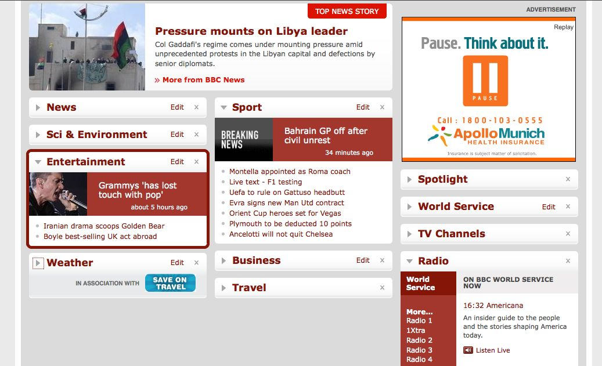
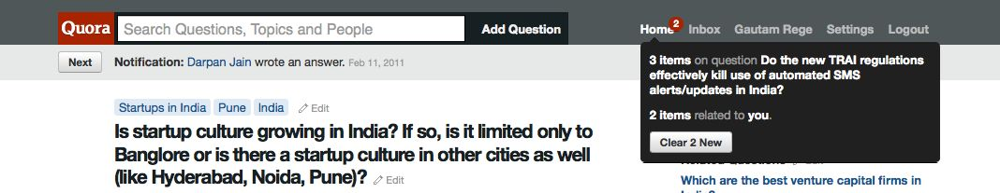
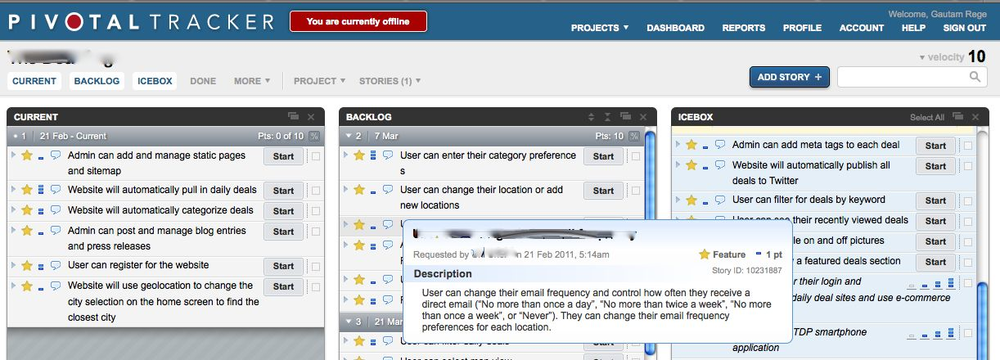
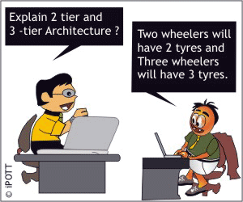

!SLIDE 
# Ruby On Rails
# The Game Changer

## Gautam Rege
## Josh Software, India
### @gautamrege

!SLIDE transition=toss
# Web-technolgy Trends
## Faster Websites (low-latency)

!SLIDE transition=toss
# Web-technolgy Trends
## Suggestive Help

!SLIDE transition=toss
# Web-technolgy Trends
## Widgets / Gadgets

!SLIDE transition=toss
# Web-technolgy Trends
## Quick Access - usability

!SLIDE transition=toss
# Web-technolgy Trends
## Offline Access!

!SLIDE transition=toss
# Need of the hour
## Reliability
## Scalability
## Usability
## Speed

!SLIDE transition=toss
# How do you do this?
## Reliability? - Large servers

!SLIDE center incremental transition=toss
# How do you do this?
## Scalability? - N-tier archicture
* 

!SLIDE transition=toss
# The big boys at play!
## How does Twitter do it?
## How does Facebook work?

!SLIDE bullets transition=toss
# Facebook infrastructure
* 60,000 web servers
* 30TB in memcached servers
* 3,000 Hadoop and Hive servers
* Each node: 8-core, 32GB RAM, 12TB space

!SLIDE bullets transition=toss
# Facebook activity

* 100 billion hits per day
* 50 billion photos
* 3 trillion objects cached
* 130 TB of logs per day

!SLIDE transition=toss
# Facebook as on  July, 2010
## OMG!
## Imagine what its like TODAY!

!SLIDE smbullets transition=toss
# Facebook architecture

* Web - Hiphop converts PHP to C++
* Thrift - communicate between different languages
* Data-store - MySQL, Memcached, Cassandra, Hadoop HBase
* Offline - Hadoop and Hive
* Logging - Scribe-HDFS 
* PHP, Python, Java, C++
* Erlang, BigPipe, Epoll 

!SLIDE bullets transition=toss
# Twitter architecture

* Javascript!(almost all of it)
* JS API (jQuery, Mustache)
* Ruby On Rails
* Scala & Starling

!SLIDE transition=toss
# Scared? - Is this for me?

!SLIDE transition=toss
# Ruby to to Rescue
## Most web startups prefer Rails
## Enterprise customers adopt Rails
## Rails3 is a power packed!

!SLIDE center transition=toss
# I love Ruby On Rails

!SLIDE bullets incremental transition=toss
# Ruby - the language

* Pure Object Oriented Script
* Blocks & Closures
* Code generates code
* Human Readable!

!SLIDE bullets incremental transition=toss
# Rails - the framework

* MVC - model / view / controller
* RESTful
* responds_to :html, :xml, :json, :anything
* In-built pluggable ORM
* Clean templates: eRB, rxml, haml

!SLIDE bullets incremental transition=toss
# The clones! 

* Groovy on Grails (Java)
* CakePHP (PHP)
* Pylons (Python)
* The power of opensource!
